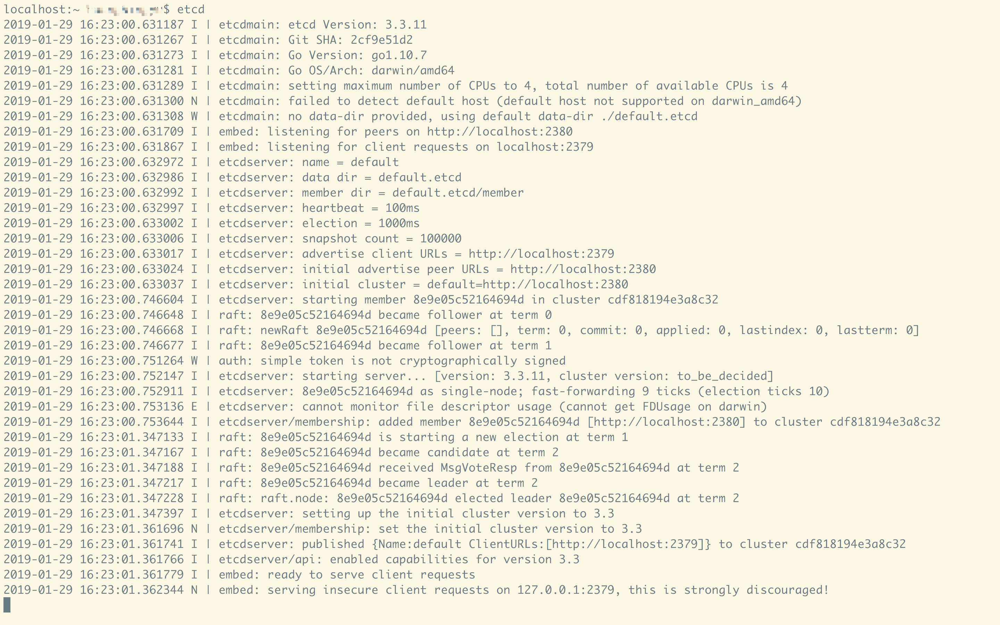
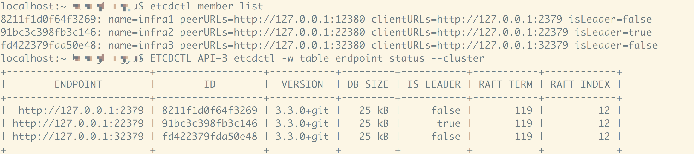

#### etcd介绍
##### 什么是etcd
- 一个高可用的分布式键值存储系统。
- 内部使用raft协议作为一致性算法
- 基于Go语言实现

##### etcd特点
&emsp;&emsp;简单、安全、快速、可靠

##### etcd用途
&emsp;&emsp;常用于服务发现、服务注册、以及配置中心

#### etcd基本使用 (基于版本3.3.11)
##### etcd安装和启动
- Go语言开发环境
- 选择合适的[发行版本](https://github.com/etcd-io/etcd/releases)下载
- 将解压文件夹下的etcd和etcdctl移动到'/usr/local/bin/'路径下
- 终端执行$etcd


- 执行下面命令成功则安装完成
```
    $etcdctl set foo bar
    OK
    $etcdctl get foo
    bar
```
##### 设置本地集群
- 获取[Procfile](https://github.com/etcd-io/etcd)文件,到**etcd**目录执行下面的操作
- 安装[goreman](https://github.com/mattn/goreman)以控制基于Procfile的应用程序:
```
    $go get github.com/mattn/goreman
```
- goreman启动集群，使用刚获取的Procfile文件
```
    $./build
    $goreman -f Procfile start
```

ps:我根据官网提示执行goreman命令，总是不能成功，最后开了三个终端，均在etcd的目录下面，分别执行Procfile文件的三条命令才成功,但是就无法使用goreman管理集群了，最后一次尝试$goreman -f Procfile start,成功了~
```
查看集群成员 :
    $etcdctl member list
查看集群成员状态：
    $ETCDCTL_API=3 etcdctl -w table endpoint status --cluster
```

- 测试集群设置成功：
```
    $etcdctl set foo bar
    OK
```

##### 同集群进行交互


