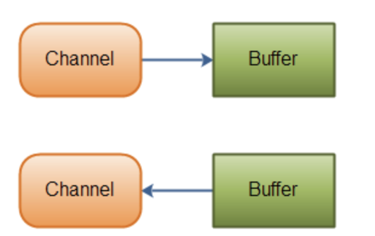
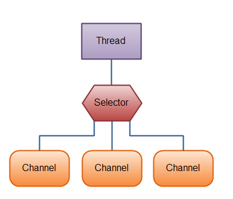

## 一、NIO基本概述

**核心API：Channel、Buffer、Selector**

### 1.Channel
    Channel & Buffer :数据可相互传输(可以从Channel读到Buffer中，也可以从Buffer 写到Channel中),如图：



#### 1.1 主要Channel的实现
涵盖了UDP 和 TCP 网络IO，以及文件IO:
- FileChannel : 从文件读写数据
- DatagramChannel ：通过UDP读写网络中的数据
- SocketChannel：通过TCP读写网络中的数据
- ServerSocketChannel：监听新进来的TCP连接，像Web服务器那样，对每个连接创建一个SocketChannle

#### 1.2 实例

```
public static void main(String[] args) {
    RandomAccessFile aFile = null;
    try {
        aFile = new RandomAccessFile("data/nio-data.txt", "rw");
        FileChannel inChannel = aFile.getChannel();
        // create buffer with capacity of 48 bytes
        ByteBuffer buf = ByteBuffer.allocate(48);
        int bytesRead = inChannel.read(buf); // read into buffer
        while (bytesRead != -1) {
            System.out.println("Read " + bytesRead);
            buf.flip();    // make buffer ready for read
            while (buf.hasRemaining()) {
                System.out.print((char) buf.get()); // read 1 bytes at a time
            }
            buf.clear(); // make buffer ready for writing
            bytesRead = inChannel.read(buf);
        }
        aFile.close();
    } catch (FileNotFoundException e) {
        e.printStackTrace();
    } catch (IOException e) {
        e.printStackTrace();
    }
}
```

### 2. Buffer
#### 2.1 关键的Buffer实现
覆盖了能通过IO发送的基本数据类型：byte, short, int, long, float, double 和 char：
- ByteBuffer
- CharBuffer
- DoubleBuffer
- FloatBuffer
- IntBuffer
- LongBuffer
- ShortBuffer

### 3. Selector
Selector允许单线程处理多个Channel,适用于多个连接，但每个连接流量很低，如聊天服务器


上图为一个单线程中使用一个Selector处理三个Channel:先得向Selector注册Channel，然后调用它的select()方法，此方法会一直阻塞到某个注册的通道有事件就绪

## 二、Channel介绍

- 通道类似流，但又有不同：既可以从通道中读取数据，又可以写数据到通道。但流的读写通常是单向的。
- 通道可以异步地读写。
- 通道中的数据总是要先读到一个Buffer，或者总是要从一个Buffer中写入。

### 1 FileChannel
连接文件的通道，以此读写文件，运行在阻塞模式下；

```
public static void main(String[] args) {
    try {
        // 打开FileChannel:通过使用InputStream,outputStream,RandomAccessFile获取FileChannel实例
        RandomAccessFile aFile = new RandomAccessFile("data/nio-data.txt","rw);
        FileChannel inChannel = aFile.getChannel();
        // 从FileChannel读取read()数据到缓冲区：
        ByteBuffer buf = ByteBuffer.allocate(48);
        int bytesRead = inChannel.read(buf);
        // 向FileChannel写入write()数据：
        String newData = "New String to write to file..." + System.currentTimeMillis();
        ByteBuffer buf = ByteBuffer.allocate(48);
        buf.clear();
        buf.put(newData.getBytes());
        buf.flip();
        while(buf.hasRemaining) { // 判断通道是否还有字符
        channel.write(buf);
        }
        // FileChannel的pisition获取FileChannel的当前位置:
        long pos = channel.position(); // 返回-1,文件结束标识
        channel.positiopn(pos + 123);
        //FileChannel的size()方法 返回通道关联的文件大小
        long fileSize = channel.size();
        // FileChannle的truncate()方法 截取文件，截取长度外的将被删除
        channle.truncate(1024); //截取当前文件的1024字节
        FileChannel的force()方法
        // 处于性能考虑，计算机系统会将数据缓存到内存，不保证写入磁盘。FileChannel  force()方法将数据强制写入磁盘中；
        channel.force(true);
        // 关闭FileChannel:
        channel.close();
    } catch (FileNotFoundException e) {
        e.printStackTrace();
    } catch (IOException e) {
        e.printStackTrace();
    }
}
```
### 2 SocketChannel

SocketChannel一个连接到TCP网络套接字的通道,创建SocketChannel的两种方式：
- 打开SocketChannel并连接到互联网的某台服务器上
- 一个连接到达ServerSocketChannel时，会自动创建一个SocketChannel

```
public static void main(String[] args) {
    try {
        // 打开SocketChannle
        SocketChannel socketChannel = SocketChannel.open();
        socketChannel.connect(new InetSocketAddress("http://jenkov.com", 80));
        // 读取SocketChannel中的数据
        ByteBuffer buffer = ByteBuffer.allocate(1024);
        int byteRead = channel.read(buffer);// 其中byteRead返回的是读了多少字节，-1则表示已经读到流的末尾
        //写入SocketChannel
        String newData = "New String data write to feil..." + System.currentTimeMillis();
        ByteBuffer buffer = ByteBuffer.allocate(48);
        buffer.put(newData.getBytes());
        buf.flip();// 由写转换成读模式
        while(buf.hasRemaining()) {
        channel.write(buf);
        }
        //非阻塞模式
        //设置非阻塞模式(non-blocking mode),可以异步调用connet(),read(),write(),但是都可能没有成功就返回了；对于connet()，通过finishConnet()判断；read()关注返回的int;write()则循环调用；
        socketChannel.configureBlocking(false);
        socket.connet(new InetSocketAddress("http://jenkov.com",80));
        whie(!socketChannel.finishConnet()) {
            //wait,or do somethind
        }
        // 关闭SocketChannle
        socketChannel.close();
    } catch (IOException e) {
        e.printStackTrace();
    } catch (Exception e) {
        e.printStackTrace();
    }
}
```
ps:非阻塞模式与选择器二者搭配，可以询问选择器哪个通道已准备好读取和写入...后续详解

### 3 ServerSocketChannel
ServerSocketChannle用于监听tcp连接

```
public static void main(String[] args) {
    try {
        // 打开ServerSocketChannel连接，
        ServerSocketChannel serverSocketChannel = ServerSocketChannel.open();
        serverSocketChannel.socket.bin(new InetSockerAddress(9999)); // 绑定9999的tcp连接
        serverSockerChannel.configureBlocking(false); //设置为非阻塞的连接
        while(true) {
            // accept()用于监听新进来的连接，阻塞模式下该方法会一直阻塞到有新的连接进来
        SocketChannel socketChannel = serverSocketChannel.accept(); // 非阻塞模式，不会阻塞在这里
        if (socketChannel != null) {
            // do somethin with socketChannel
        }
        //关闭连接
        serverSocketChannel.close();
    } catch (IOException e) {
        e.printStackTrace();
    } catch (Exception e) {
        e.printStackTrace();
    }
}
```
### 4 DataGramChannel
收发UDP包的通道，UDP是无连接的网络协议，所以不是写入和读取操作，而是发送和接受数据包。
打开：
```
public static void main(String[] args) {
    try {
        DataGramChannel dataGramChannel = DataGramChannel.open();
        dataGramChannel.socket().bind(new InetSocketAddress(9999));  // 接收来自9999的数据包
        接收数据：
        ByteBuffer buf = ByteBuffer.allocate(48);
        buf.clear();
        channel.receive(buf); // receive()方法将接收到的数据包内容复制到buf上，buf容不下的数据，将会被丢弃
        // 发送数据
        String data = "New String to send to dataGramChannel.." + System.currentTimeMills();
        ByteBuffer buf  = ByteBuffer.allocate(48);
        buf.clear();
        buf.put(data.getBytes());
        buf.flip();
        // 无法确认数据是否已经发送到80端口，UDP在数据传送方面没有任何保证
        int byteSend = channel.send(buf, new InetSocketAddress("jenkov.com", 80));
        // 连接到特定地址,可使用read()和write()：
        // 无法完成真正的连接，只能锁住DataGramChannel，让其从特定的地址收发数据
        channel.connect(new InetSocketChannle("jenkov.com", 80));
        int bytesRead = channel.read(buf);
        int bytesWrite = channel.write(buf);
    } catch (IOException e) {
        e.printStackTrace();
    } catch (Exception e) {
        e.printStackTrace();
    }
}
```
### 5 AsynChronousFileChannel
AsynChronousFileChannel 用于异步读取和写入文件

#### 5.1 使用Future读取数据
```
public static void main(String[] args) {
    try {
        // 使用opne()方法创建一个AsynChronousFileChannel
        Path path = Paths.get("data/test.xml");
        // 第一个参数为PATH对象, 第二个参数表示对文件的操作
        AsynChronousFileChannel fileChannel = AsynChronousFileChannel.open(path, StandardOpenOption.READ);
        // 读取文件到缓冲区，分配缓冲区打下，设置开始写入的位置
        ByteBuffer buffer = ByteBuffer.allocate(1024);
        long position = 0;
        // 使用AsynChronousfileChannel对象的read()方法对文件进行读取，返回结果结果用Future接受
        Future<Integer> operation = fileChannle.read(buffer, position);
        // 如果没有读取完成，cpu会空转一段时间，但是不可避免，后面的操作会依赖
        while(!operation.isDone()) ;
        // 从缓冲区读取数据，并输出
        buffe.flip();
        byte[] data = new byte[buffer.limit()];
        buffer.get(data);
        System.out.println(new String(data));
        buffer.clear();
    } catch (IOException e) {
        e.printStackTrace();
    } catch (Exception e) {
        e.printStackTrace();
    }
}
```
#### 5.2 使用CompletionHandler读取数据
public static void main(String[] args) {
    try {
        // AsynChronousFileChannel的另一个重载的read()方法进行读取文件数据，使CompletionHandler作为参数；读取成功会调用CompletionHandler的completed(),读取失败调用其failed()方法。
        fileChannel.read(buffer, position, buffer, new CompletionHandler<Integer, ByteBuffer>() {
            // 第一个参数是读取的字节数，第二参数存储读取的数据，为read(）的第三个参数
            @Override
            public void completed(Integer result, ByteBuffer attament) {
            System.out.println("result = " + result);
            attament.flip();
            byte[] data = new byte[attament.limit()];
            attament.get(data);
            System.out.println(new String(data));
            attament.clear();
            }

            @Override
            public void failed(Throwable exc, ByteBuffer attament) {
            }
        });
    } catch (IOException e) {
        e.printStackTrace();
    } catch (Exception e) {
        e.printStackTrace();
    }
}
```

#### 5.3 使用Future写入数据

public static void main(String[] args) {
    try {
        // 使用opne()方法创建一个AsynChronousFileChannel
        Path path = Paths.get("data/test.xml");
        // 第一个参数为PATH对象, 第二个参数表示对文件的操作
        AsynChronousFileChannel fileChannel = AsynChronousFileChannel.open(path, StandardOpenOption.WRITE);
        // buffe中写入数据
        ByteBuffer buffer = ByteBuffer.allocate(1024);
        long position = 0;
        buffer.put("test data".getBytes());
        buffer.flip();
        // 使用AsynChronousfileChannel对象的write()方法对文件进行写入，返回结果结果用Future接受
        Future<Integer> operation = fileChannle.write(buffer, position);
        buffer.clear();
        // 如果没有读取完成，cpu会空转一段时间，但是不可避免，后面的操作会依赖
        while(!operation.isDone()) ;
    } catch (IOException e) {
        e.printStackTrace();
    } catch (Exception e) {
        e.printStackTrace();
    }
}
```


#### 5.4 使用CompletionHandler写入数据
```
public static void main(String[] args) {
    try {
        fileChannel.read(buffer, position, buffer, new CompletionHandler<Integer, ByteBuffer>() {
        // 第一个参数是读取的字节数，第二参数存储读取的数据，为read(）的第三个参数
        @Override
        public void completed(Integer result, ByteBuffer attament) {
        System.out.println("result = " + result);
        attament.flip();
        byte[] data = new byte[attament.limit()];
        attament.get(data);
        System.out.println(new String(data));
        attament.clear();
        }
        @Override
        public void failed(Throwable exc, ByteBuffer attament) {
        }
        });
    } catch (IOException e) {
        e.printStackTrace();
    } catch (Exception e) {
        e.printStackTrace();
    }
}

```
