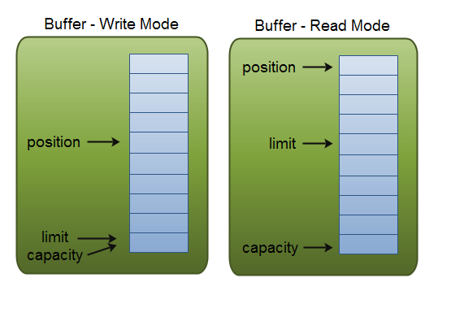
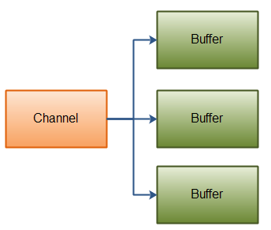
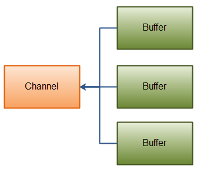

## 一、NIO基本概述

**核心API：Channel、Buffer、Selector**

### 1.Channel
    Channel & Buffer :数据可相互传输(可以从Channel读到Buffer中，也可以从Buffer 写到Channel中),如图：


#### 1.1 主要Channel的实现
涵盖了UDP 和 TCP 网络IO，以及文件IO:
- FileChannel : 从文件读写数据
- DatagramChannel ：通过UDP读写网络中的数据
- SocketChannel：通过TCP读写网络中的数据
- ServerSocketChannel：监听新进来的TCP连接，像Web服务器那样，对每个连接创建一个SocketChannle

#### 1.2 实例

```
public static void main(String[] args) {
    RandomAccessFile aFile = null;
    try {
        aFile = new RandomAccessFile("data/nio-data.txt", "rw");
        FileChannel inChannel = aFile.getChannel();
        // create buffer with capacity of 48 bytes
        ByteBuffer buf = ByteBuffer.allocate(48);
        int bytesRead = inChannel.read(buf); // read into buffer
        while (bytesRead != -1) {
            System.out.println("Read " + bytesRead);
            buf.flip();    // make buffer ready for read
            while (buf.hasRemaining()) {
                System.out.print((char) buf.get()); // read 1 bytes at a time
            }
            buf.clear(); // make buffer ready for writing
            bytesRead = inChannel.read(buf);
        }
        aFile.close();
    } catch (FileNotFoundException e) {
        e.printStackTrace();
    } catch (IOException e) {
        e.printStackTrace();
    }
}
```

### 2. Buffer
#### 2.1 关键的Buffer实现
覆盖了能通过IO发送的基本数据类型：byte, short, int, long, float, double 和 char：
- ByteBuffer
- CharBuffer
- DoubleBuffer
- FloatBuffer
- IntBuffer
- LongBuffer
- ShortBuffer

### 3. Selector
Selector允许单线程处理多个Channel,适用于多个连接，但每个连接流量很低，如聊天服务器


上图为一个单线程中使用一个Selector处理三个Channel:先得向Selector注册Channel，然后调用它的select()方法，此方法会一直阻塞到某个注册的通道有事件就绪

## 二、Channel介绍

- 通道类似流，但又有不同：既可以从通道中读取数据，又可以写数据到通道。但流的读写通常是单向的。
- 通道可以异步地读写。
- 通道中的数据总是要先读到一个Buffer，或者总是要从一个Buffer中写入。

### 1 FileChannel
#### 1.1 FileChannel基本用法
连接文件的通道，以此读写文件，运行在阻塞模式下；

```
public static void main(String[] args) {
    try {
        // 打开FileChannel:通过使用InputStream,outputStream,RandomAccessFile获取FileChannel实例
        RandomAccessFile aFile = new RandomAccessFile("data/nio-data.txt","rw);
        FileChannel inChannel = aFile.getChannel();
        // 从FileChannel读取read()数据到缓冲区：
        ByteBuffer buf = ByteBuffer.allocate(48);
        int bytesRead = inChannel.read(buf);
        // 向FileChannel写入write()数据：
        String newData = "New String to write to file..." + System.currentTimeMillis();
        ByteBuffer buf = ByteBuffer.allocate(48);
        buf.clear();
        buf.put(newData.getBytes());
        buf.flip();
        while(buf.hasRemaining) { // 判断通道是否还有字符
        channel.write(buf);
        }
        // FileChannel的pisition获取FileChannel的当前位置:
        long pos = channel.position(); // 返回-1,文件结束标识
        channel.positiopn(pos + 123);
        //FileChannel的size()方法 返回通道关联的文件大小
        long fileSize = channel.size();
        // FileChannle的truncate()方法 截取文件，截取长度外的将被删除
        channle.truncate(1024); //截取当前文件的1024字节
        FileChannel的force()方法
        // 处于性能考虑，计算机系统会将数据缓存到内存，不保证写入磁盘。FileChannel  force()方法将数据强制写入磁盘中；
        channel.force(true);
        // 关闭FileChannel:
        channel.close();
    } catch (FileNotFoundException e) {
        e.printStackTrace();
    } catch (IOException e) {
        e.printStackTrace();
    }
}
```

#### 1.2 通道之间传输数据
如果两个通道之间有一个是FileChannel,可以直接将一个通道的数据传递到另一通道

- transferFrom()，将数据从源通道传输到FileChannel中，
- transferTo(), 将数据从fileChannel传输到其他channel中：
```
public static void main(String[] args) {
    try {
        
        RandomAccessFile fromFile = new RandomAccessFile("fromFlie.txt", "rw");
        FileChannel fromChannel = fromFile.getChannel();
        RandomAccessFile toFile = new RandomAccessFile("toFile.txt", "rw");
        FileChannel toChannel = toFile.getChannnel();
        long position = 0 ;
        long count = fromChannel。size();
        // transferFrom() 入参position 表示从position处开始向目标文件写数据，coun表示最多传输的字节数。
        toChannel.transfrom(position, count, fromChannel); // fromChannel可以为其他非FileChannel
        // transferTo()
        fromChannel.transferTo(position, count, toChannel);// toChannel可以为其他非FileChannel
    } catch (FileNotFoundException e) {
        e.printStackTrace();
    } catch (IOException e) {
        e.printStackTrace();
    }
}
```

### 2 SocketChannel

SocketChannel一个连接到TCP网络套接字的通道,创建SocketChannel的两种方式：
- 打开SocketChannel并连接到互联网的某台服务器上
- 一个连接到达ServerSocketChannel时，会自动创建一个SocketChannel

```
public static void main(String[] args) {
    try {
        // 打开SocketChannle
        SocketChannel socketChannel = SocketChannel.open();
        socketChannel.connect(new InetSocketAddress("http://jenkov.com", 80));
        // 读取SocketChannel中的数据
        ByteBuffer buffer = ByteBuffer.allocate(1024);
        int byteRead = channel.read(buffer);// 其中byteRead返回的是读了多少字节，-1则表示已经读到流的末尾
        //写入SocketChannel
        String newData = "New String data write to feil..." + System.currentTimeMillis();
        ByteBuffer buffer = ByteBuffer.allocate(48);
        buffer.put(newData.getBytes());
        buf.flip();// 由写转换成读模式
        while(buf.hasRemaining()) {
        channel.write(buf);
        }
        //非阻塞模式
        //设置非阻塞模式(non-blocking mode),可以异步调用connet(),read(),write(),但是都可能没有成功就返回了；对于connet()，通过finishConnet()判断；read()关注返回的int;write()则循环调用；
        socketChannel.configureBlocking(false);
        socket.connet(new InetSocketAddress("http://jenkov.com",80));
        whie(!socketChannel.finishConnet()) {
            //wait,or do somethind
        }
        // 关闭SocketChannle
        socketChannel.close();
    } catch (IOException e) {
        e.printStackTrace();
    } catch (Exception e) {
        e.printStackTrace();
    }
}
```
ps:非阻塞模式与选择器二者搭配，可以询问选择器哪个通道已准备好读取和写入...后续详解

### 3 ServerSocketChannel
ServerSocketChannle用于监听tcp连接

```
public static void main(String[] args) {
    try {
        // 打开ServerSocketChannel连接，
        ServerSocketChannel serverSocketChannel = ServerSocketChannel.open();
        serverSocketChannel.socket.bin(new InetSockerAddress(9999)); // 绑定9999的tcp连接
        serverSockerChannel.configureBlocking(false); //设置为非阻塞的连接
        while(true) {
            // accept()用于监听新进来的连接，阻塞模式下该方法会一直阻塞到有新的连接进来
        SocketChannel socketChannel = serverSocketChannel.accept(); // 非阻塞模式，不会阻塞在这里
        if (socketChannel != null) {
            // do somethin with socketChannel
        }
        //关闭连接
        serverSocketChannel.close();
    } catch (IOException e) {
        e.printStackTrace();
    } catch (Exception e) {
        e.printStackTrace();
    }
}
```
### 4 DataGramChannel
收发UDP包的通道，UDP是无连接的网络协议，所以不是写入和读取操作，而是发送和接受数据包。
打开：
```
public static void main(String[] args) {
    try {
        DataGramChannel dataGramChannel = DataGramChannel.open();
        dataGramChannel.socket().bind(new InetSocketAddress(9999));  // 接收来自9999的数据包
        接收数据：
        ByteBuffer buf = ByteBuffer.allocate(48);
        buf.clear();
        channel.receive(buf); // receive()方法将接收到的数据包内容复制到buf上，buf容不下的数据，将会被丢弃
        // 发送数据
        String data = "New String to send to dataGramChannel.." + System.currentTimeMills();
        ByteBuffer buf  = ByteBuffer.allocate(48);
        buf.clear();
        buf.put(data.getBytes());
        buf.flip();
        // 无法确认数据是否已经发送到80端口，UDP在数据传送方面没有任何保证
        int byteSend = channel.send(buf, new InetSocketAddress("jenkov.com", 80));
        // 连接到特定地址,可使用read()和write()：
        // 无法完成真正的连接，只能锁住DataGramChannel，让其从特定的地址收发数据
        channel.connect(new InetSocketChannle("jenkov.com", 80));
        int bytesRead = channel.read(buf);
        int bytesWrite = channel.write(buf);
    } catch (IOException e) {
        e.printStackTrace();
    } catch (Exception e) {
        e.printStackTrace();
    }
}
```
### 5 AsynChronousFileChannel
AsynChronousFileChannel 用于异步读取和写入文件

#### 5.1 使用Future读取数据
```
public static void main(String[] args) {
    try {
        // 使用opne()方法创建一个AsynChronousFileChannel
        Path path = Paths.get("data/test.xml");
        // 第一个参数为PATH对象, 第二个参数表示对文件的操作
        AsynChronousFileChannel fileChannel = AsynChronousFileChannel.open(path, StandardOpenOption.READ);
        // 读取文件到缓冲区，分配缓冲区打下，设置开始写入的位置
        ByteBuffer buffer = ByteBuffer.allocate(1024);
        long position = 0;
        // 使用AsynChronousfileChannel对象的read()方法对文件进行读取，返回结果结果用Future接受
        Future<Integer> operation = fileChannle.read(buffer, position);
        // 如果没有读取完成，cpu会空转一段时间，但是不可避免，后面的操作会依赖
        while(!operation.isDone()) ;
        // 从缓冲区读取数据，并输出
        buffe.flip();
        byte[] data = new byte[buffer.limit()];
        buffer.get(data);
        System.out.println(new String(data));
        buffer.clear();
    } catch (IOException e) {
        e.printStackTrace();
    } catch (Exception e) {
        e.printStackTrace();
    }
}
```
#### 5.2 使用CompletionHandler读取数据
public static void main(String[] args) {
    try {
        // AsynChronousFileChannel的另一个重载的read()方法进行读取文件数据，使CompletionHandler作为参数；读取成功会调用CompletionHandler的completed(),读取失败调用其failed()方法。
        fileChannel.read(buffer, position, buffer, new CompletionHandler<Integer, ByteBuffer>() {
            // 第一个参数是读取的字节数，第二参数存储读取的数据，为read(）的第三个参数
            @Override
            public void completed(Integer result, ByteBuffer attament) {
            System.out.println("result = " + result);
            attament.flip();
            byte[] data = new byte[attament.limit()];
            attament.get(data);
            System.out.println(new String(data));
            attament.clear();
            }

            @Override
            public void failed(Throwable exc, ByteBuffer attament) {
            }
        });
    } catch (IOException e) {
        e.printStackTrace();
    } catch (Exception e) {
        e.printStackTrace();
    }
}
```

#### 5.3 使用Future写入数据

public static void main(String[] args) {
    try {
        // 使用opne()方法创建一个AsynChronousFileChannel
        Path path = Paths.get("data/test.xml");
        // 第一个参数为PATH对象, 第二个参数表示对文件的操作
        AsynChronousFileChannel fileChannel = AsynChronousFileChannel.open(path, StandardOpenOption.WRITE);
        // buffe中写入数据
        ByteBuffer buffer = ByteBuffer.allocate(1024);
        long position = 0;
        buffer.put("test data".getBytes());
        buffer.flip();
        // 使用AsynChronousfileChannel对象的write()方法对文件进行写入，返回结果结果用Future接受
        Future<Integer> operation = fileChannle.write(buffer, position);
        buffer.clear();
        // 如果没有读取完成，cpu会空转一段时间，但是不可避免，后面的操作会依赖
        while(!operation.isDone()) ;
    } catch (IOException e) {
        e.printStackTrace();
    } catch (Exception e) {
        e.printStackTrace();
    }
}
```


#### 5.4 使用CompletionHandler写入数据
```
public static void main(String[] args) {
    try {
        fileChannel.read(buffer, position, buffer, new CompletionHandler<Integer, ByteBuffer>() {
        // 第一个参数是读取的字节数，第二参数存储读取的数据，为read(）的第三个参数
        @Override
        public void completed(Integer result, ByteBuffer attament) {
        System.out.println("result = " + result);
        attament.flip();
        byte[] data = new byte[attament.limit()];
        attament.get(data);
        System.out.println(new String(data));
        attament.clear();
        }
        @Override
        public void failed(Throwable exc, ByteBuffer attament) {
        }
        });
    } catch (IOException e) {
        e.printStackTrace();
    } catch (Exception e) {
        e.printStackTrace();
    }
}

```

## 三、Buffer
### 1.基本用法分
#### 1.1 读写数据四步：
- a.写入数据到Buffer
- b.调用flip()方法
- c.从Buffer中读取数据
- d.调用clear()方法或者compact()方法

#### 1.2 读写过程：
- a.向buffer写入多少数据，就会记录下多少数据。
- b.要读取数据，通过flip()方法将Buffer从写模式切换到读模式。
- c.在读模式下，可以读取之前写入到buffer的所有数据。
- d.读完数据，清空缓冲区，让它可以再次被写入。有两种方式能清空缓冲区：调用clear()或compact()方法。
- e.使用clear()方法会清空整个缓冲区的数据。compact()方法只会清除已经读过的数据。任何未读的数据都被移到缓冲区的起始处，新写入的数据将放到缓冲区未读数据的后面。


### 2 Buffer的三个属性Capacity、position、limit
缓存区的本质是一块可以读写数据的内存，被包装成NIO Buffer 对象，用来方便的访问该块内存，其中三个属性，position和limit的含义取决于Buffer处在读模式还是写模式。不管Buffer处在什么模式，capacity的含义总是一样的

- capacity : Buffer固定大小，可以往其中写byte、long、char等类型，写满后需要清空(读取或清除数据)才可继续写。
- position:写数据的时候是当前位置;切换成读数据的时候，position会被置为0，读取数据时，position向前移动到下一个可读的位置。
- limit:写模式下，limit表示最多能往buffer里写多少数据，值等于capacity;读模式下，limit被设置为能读到之前写入的所有数据时的positon值。

### 3 Buffer的方法
#### 3.1 Buffer的分配
使用各个Buffer类的allocate方法获得Buffer对象,参数为缓冲区的大小:
```
    ByteBuffer buffer  = ByteBuffer.allocate(48)；
    CharBuffer buffer = CharBuffer.allocate(1024);
```
#### 3.2 向Buffer中写数据
```
    // 从Channel写到Buffer
    int bytesRead = inChannel.read(buf);
    // 通过Buffer的put()方法写到Buffer里。  
    buf.put(127)
```

#### 3.4 切换Buffer由写模式到读模式
```
    buf.flip()
    // 该方法的操作是：postion设为0，用于标记读的位置，limit设置为之前position的位置。limit表示之前写进了多少个byte、char等 —— 现在能读取多少个byte、char等
```

#### 3.5 从Buffer中读取数据
```
    // 从Buffer读取数据到Channel。
    int bytesRead = inChannel.write(buf)
    //使用get()方法从Buffer中读取数据。 
    byte aByte = bug.get();
```

#### 3.6 重读Buffer所有数据
```
    Buffer.rewind()
    // 该方法的操作：position设回0，limit保持不变，仍然表示能从Buffer中读取多少个元素
```

#### 3.7 清除数据
```
    buffer.clear();
    //clear()方法，position将被设回0，limit被设置成 capacity的值,数据并未被清除，标记从哪里开始写数据，之前的数据被覆盖掉。
    buffer.compact()
    // compact()方法，将未读数据拷贝到Buffer起始处，position设置到最后一个未读数据正后面，limit属性被设置成 capacity的值
```

#### 3.8 标记和恢复position
```
    //mark()方法，可以标记Buffer中的一个特定position
    buffer.mark()
    // 通过调用reset恢复到这个position
    buffer.reset()
```

#### 3.9 buffer比较方法
*equal()*
```
    //只是比较Buffer的一部分，不是每一个在它里面的元素都比较。
    buffer.equals();
```
它只比较Buffer中的从 position到limit之间的元素 :
- 有相同的类型（byte、char、int等）。
- Buffer中剩余的byte、char等的个数相等。
- Buffer中所有剩余的byte、char等都相同。

*compareTo()*
```
    //方法比较两个Buffer的从 position到limit之间的元素(byte、char等)
    buffer.compareTo()
```
如果满足下列条件，则认为一个Buffer“小于”另一个Buffer：
- 第一个不相等的元素小于另一个Buffer中对应的元素 。
- 所有元素都相等，但第一个Buffer比另一个先耗尽(第一个Buffer的元素个数比另一个少)

### 4.Scatter/Gather (分散和聚集)
学习了通道和缓冲区的知识，下面介绍两个描述通道读写的操作。假设一种场景，需要将数据分散处理，如果传递消息头和消息体的数据，就需要分散到不同的buffer,便于读取；聚散是分散的逆过程，组合传递的消息进行发送；

*Scatter*
    分散（Scattering reads）:读取channel的数据写入到多个buffer中，如图



示例：
 ```
    ByteBuffer head = ByteBuffer.allocate(128);
    ByteBuffer body  = ByteBuffer.allocate(1024);
    ByteBuffer[] bufferArray = {head, body};// 将buffer插入buffer数组
    channel.read(bufferArray); // 多个buffer作为read方法的输入参数
```   
ps:
- read()方法会按照buffer在数组中的顺序从channel中写入数据到buffer，一个buffer写满才会写另一个
- 如上述代码，消息头必须固定为128,移动下一个buffer前，必须填满当前的buffer，这也意味着它不适用于动态消息

*Gather*
    （聚集 gathing writes）将多个Buffer的数据写入到同一个Channel中,如图：


示例：
```
    ByteBuffer head = ByteBuffer.allocate(128);
    ByteBuffer body  = ByteBuffer.allocate(1024);
    ByteBuffer[] bufferArray = {head, body};// 将buffer插入数据
    channel.write(bufferArray); // 多个buffer作为read方法的输入参数
```
ps:
- write()方法按照buffer在数组中的顺序写入到channel
- 只有position和limit的数据才会被写入,如果一个buffer的容量为128byte，但是仅仅包含58byte的数据，那么这58byte的数据将被写入到channel中
- gathering writes能较好处理动态消息

## 四.Pipe
NIO管道是两个数据之间的单向数据连接。Pipe有一个Sink通道往Pipe写数据，一个Source通道，从Pipe读数据。原理图：


*pipe使用示例*
```
    // 创建管道
    Pipe pipe = Pipe.open();
    // 向管道写数据：SinkChannel的write()方法
    Pipe.SinkChannle sinkChannel = pipe.sink();
    String newData = "New String to Write to file..." + System.currentTimeMills();
    ByteBuffer buf =  ByteBuffer.allocate(48);
    buf.clear();
    buf.put(newData.getBytes());
    buf.flip();
    while(buf.hasRemaining()) {
    sinkChannel.write(buf);
    }
    // 从管道读数据：SourceChannel的read()方法
    Pipe.SourceChannel spurceChannel = pipe.source();
    ByteBuffer buf = ByteBuffer.allocate(48);
    int bytedsRead = sourceChannel.read(buf); //bytedsRead 值表示多少字节被读入缓冲区；
```

## 五、Selector
*selector* 是检查NIO通道是否准备好进行读写事件的组件，这样，一个单独的线程可以管理多个channel,从而管理多个网络连接。（在这里，只要知道使用Selector能够处理多个通道）

### 1.为什么使用seletor
可以单线程处理所有的通道，以减少线程之间上下文切换的开销，减少占用的系统资源(如内存)。

### 2.怎么使用seletor
#### 2.1 示例
```
    // Selector创建
    Selector selector = Selector.open();
    // 向Selector注册通道
    channel.configureBlocking(false);	// 设置非阻塞模式同Selector一起使用的，channel不能为非阻塞模式，FileChannel不能切换成非阻塞模式，不能同Selector一起使用
    SelectionKey key = channel.register(selector, SelectionKey.OP_READ); // register 方法的第二个参数是监听的事件类型(Connect、Accept、Read、Write)的insterest集合
    // 选择通道
    selector.select()//返回调用前就绪了的通道
    // 线程调用select()方法后若没有通道就绪就一直阻塞
    selector.wakeUp() //阻塞的线程就会返回；如果当前无线程阻塞，下一个调用select()方法的线程会立即返回；
    // 关闭Selector
    selector.close();
```

#### 2.2 SelectionKey
调用channel.register() 向Selector注册通道，返回的SelctionKey对象，其中包括了一些你感兴趣的属性：interest 集合、ready 集合、可选的 附加对象

*SelectionKey的操作*
```
    // 使用selectionKey访问channel & selctor
    Channel channel = selectionKey.channel();
    Selector selector  = seelctorKey.selector();
    // 移除selectedKeys实例
    Set selectedKeys = selector.selectKeys()
    Iterato keyIterator = selectedKeys.iterator();
    keyIterator.remove(); 
```

#### 2.3 interest 集合

selector设置检测interest的事件，一旦通道触发了事件，表示该事件就绪，Connect、Accept、Read、Write，四个事件分别用四个常量来表示：
- SelectionKey.OP_CONNECTION
- SelectionKey.OP_ACCEPT
- SelectionKey.OP_READ
- SelectionKey.OP_WRITE

如果对不止一件事情感兴趣，使用“位或”操作符将常量连接起来,如：
```
    int interestSet = SelectionKey.OP_READ | SelectionKey.OP_WRITE
```

如何知道selector监听的interest的事件
```
    // 通过“位于”操作interestSet集合和SelectionKey常量，可以确定某个事件是否在interestSet中
    int interestSet  = selectionKey.interestOps();
    boolean isInterestInAccept = (interestSet & SelectionKey.OP_CONNECTION) == SelectionKey.OP_CONNECTION;
    boolean isInterestInConnect = (interestSet & SelectionKey.OP_ACCEPT) == SelectionKey.OP_ACCEPT;
    boolean isInterestInRead = interestSet & SelectionKey.OP_READ == SelectionKey.OP_ACCEPT;
    boolean isInterestInWrite = interestSet & SelctionKey.OP_WRITE == SelectionKey.OP_ACCEPT;
```

#### 2.4 ready 集合
ready集合是已经准备就绪的操作的集合
```
    // 访问ready集合的方式
    int readySet = selectionKey.readyOps();
```
检测通道就绪的事件：
- selectionKey.isAcceptable();
- selectionKey.isConnectable();
- selectionKey.isReadabe();
- selectionKey.isWritable();

#### 2.5 可选的附加对象
```
    // 将一个对象或者更多信息附着到SelectionKey上，这样就能方便的识别某个给定的通道:
    selectionKey.attach(theObject);
    Object attachObj = selectionKey.attachment();

    // 可以在注册的时候附加对象：
    SelectionKey key = channel.register(selector, SelectionKey.OP_READ, theObject);
```


