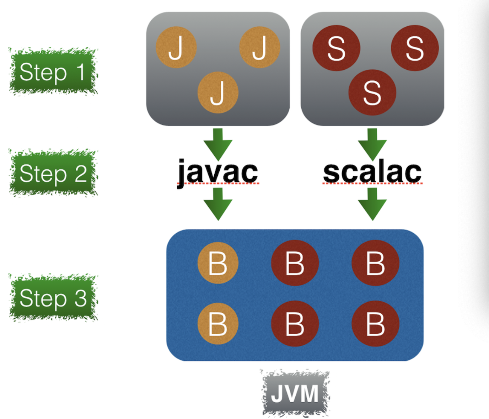
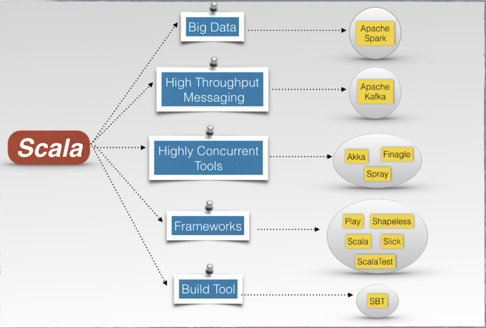
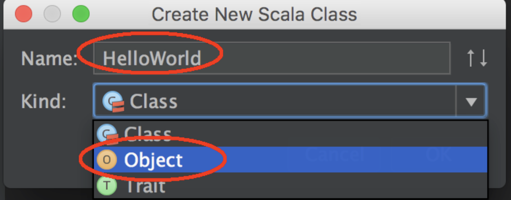

### 一、Scala初识
#### 1. Scala编程语言特性

    Scala是运行在JVM上面向对象的函数式编程语言

#### 2. Scala源码

 [GitHub Scala repository](https://github.com/scala/scala)

#### 3. Scala运行环境
    
- JDK/JVM 是一组用于开发java应用程序的库和应用程序，其中包括了JRE
- 使用下面一张图让我们了解java程序和scala程序和JVM的关系：



#### 4.Scala特性

- 函数式编程特点：以著名质能方程为例  *E = MC²* ,C是已知的光速为常量值，通过获得质量M计算能量E。scala定义的函数只实现一个操作，其内部不能有副作用，即不能拥有隐藏的行为。
- 变量的不变性: 定义一个变量并初始化，那么在直到程序结束，该变量的值不变
- 组合函数： 根据上述两个特点，我们应该在严格的数学意义上封装函数，再通过多个函数构成更多函数，如同"乐高积木"
- 高阶函数： 以其他的函数作为参数来创建高阶函数
- 模式匹配
- 异步和并行编程
- 依赖注入
- 可扩展性
- Scala生态系统

- Java和Scala可混合使用

**在以后使用scala的过程中，会对上述特性具体化**

### 二、使用IDEA初步开发Scala程序

首先需要下面的运行环境
- 安装 JDK[Jvava Development Kit](https://www.oracle.com/technetwork/java/javase/downloads/jdk8-downloads-2133151.html)
- 安装 [IntelliJ IDE](https://www.jetbrains.com/idea/download/)
- 安装 scala插件(Preferences->plugins->Install JetBrain plugin->Scala)

#### 1. 从HelloWorld开始
- Create New Project->左侧选scala(left)&右侧选sbt->输入项目名->选择sbt version(0.13.8)&选择scala version(2.11.8)->finish
- 创建HelloWorld.scala（其中Kind选择Object）
(如何创建Scala class没找到尝试下面几个操作)
    - 右击src->选择"Mark directory as"->"Sources Root"
    - project structure(快捷键 command + ；)->Gloabl Libraries: new Gloabl Libraries->Scala SDK->选择创建时的版本2.11.8



**a. 继承App特性**
```java
object HelloWorld extends App {
  println("Hello world from Scala")
}
```
**b. 不继承App,则创建main函数**
```java
    object HelloWorldMain {
        def main(args: Array[String]): Unit={
            println("Hello world from main function")
        }
    }
```
**查看App特性，发现其中包括了main函数**

**c.main函数传入参数：**
```java
    object HelloWorldWithArguments {
        def main(args: Array[String]): Unit={
            println("Hello world with arguments")
            println("Command lines are:")
            println(args.mkstring(","))
        }
    }
```
- Edit configurations->HelloWorldWithArguments->Program arguments->firstargument secondargument third argument
- run "HelloWorldWithArguments"

#### 2. sbt介绍
- sbt [Scala build tool](https://www.scala-sbt.org/0.13/docs/index.html)：Scala的构建工具
- 使用sbt引入外部库,以[Scala Logging library](https://github.com/lightbend/scala-logging)为例
    -  build.sbt文件添加：
        ```json
            libraryDependencies ++= Seq(
            "ch.qos.logback" % "logback-classic" % "1.1.7",
            "com.typesafe.scala-logging" %% "scala-logging" % "3.4.0")
        ```
    - Scala object:
        ```java
            import com.typesafe.scalalogging.LazyLogging
            object HelloWorldWithScalaLogging extends App with LazyLogging{
                 logger.info("Hello world withs Scala Logging")
            }
        ```
    - 查看External Libraries,会看到新增的相关log库
- IDEA下载外部库的位置：[Maven Central->外部库的存储仓库](https://maven.apache.org/what-is-maven.html),maven本身提供一套工具和实用程序,来帮助完成有关构建和部署的软件的所有内容
- 如何搜索外部库：[Maven Central repository](https://search.maven.org) 或者[maven repository](https://mvnrepository.com)

- "com.typesafe.scala-logging" %% "scala-logging" % "3.4.0" 分别对应 Groupid %% Artifactid % Version


### 三、IDEA相关快捷键（mac）
Scala的基本使用先介绍到这，下面借此文章，总结一下IDEA的快捷键：

- 搜索Classes：**command + o**
- 搜索Files: **command + shift + o**
- 全局搜索： **双击shift**
- 回到上一个编辑的位置：**command + shift + backspace**
- 查看文件结构：**command + F12**
- 快速查找并替换：**command + control + g**
- 查找引用：**option + F7**
- 查看表达式类型： **Ctrl + Shift + P**


