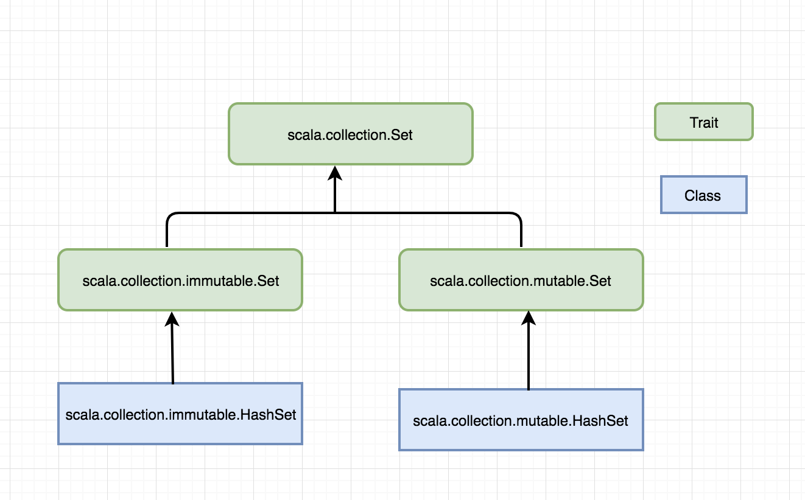
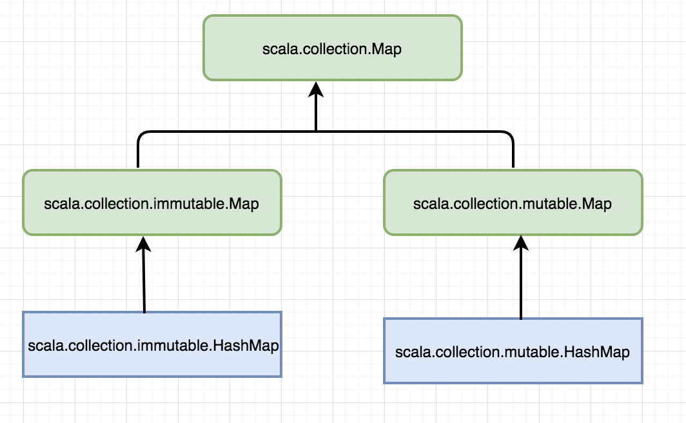

### 一、基础语法
#### 1.定义变量
*两种类型的变量*
val:一旦初始化后不能重新赋值
var：可以任意重新赋值
```
// 三种定义方式
val msg = "Hello World"
val msg2:String = "Hello World again"
//| 表示换行
val msg3 = 
    | "Hello world again and again"
```

#### 2.定义函数

```
    // def来定义函数
    def  max(x:Int,y:Int):Int={
         if(x>y) x
         else
            y
    }
    // 返回类型Unit类似java void
    def greet() = println("Hello, World")
```

#### 3.while、foreach和for循环
```
    // 数据定义(),获取数据的值()而非[]
    val args = Array("I", "like","Scala")
    var i = 0 //必须定义可变，后续才能i+=1
    // (1)while
    while (i < args.length) {
        println(args(i))
        i += 1 //scala没有++i和i++
    }
    // (2)foreach
    args.foreach(arg=>println(arg))
    // (3)for
    for(arg<-args)
        println(arg)
```
#### 4.类型参数化数组
    java的泛型，scala使用方括号指明数据类型参数
```
    // 指明是String类型
    val greetStrings = new Array[String](3)
    greetString(0) = "Hello"
    greetString(1) = ","
    greetString(2) = "World"
    // i (0).to(2) 调用的整数类型的to方法，Scala基本规则：方法只有一个参数，可以不用括号的.调用该方法，所以省略括号和.
    for(i<- 0 to 2)
        print(greetString(i))
    // 数据第二种初始化方法
    val greetStrings = Array("Hello", ",", "World")
```

#### 5.Lists
Array数据可变，Lists类提供不可修改的序列
```
    // 使用:::连接两个列表
    val oneTwo = List(1,2)
    val threeFour = List(3,4)
    val oneTwoThreeFour = oneTwo ::: threeFour
    println(oneTwo + " and " + threeFour + " were not mutated.")
    println("Thus, " + oneTwoThreeFour + "is a new list)
    // 使用常量创建数据列表List(1,2,3)的两种方法
    val oneTwoThree = 1::2::3::Nil
    val oneTwoThree = Nil.::3.::2.::1
```

#### 6.元组(Tuples)
List只能包含相同数据类型的数据，Tuples可以包含不同类型，在方法返回多个结果非常有用
```
    // 访问元组使用._和索引，Scala支持元组的最大长度为22,如果有需要，可以自己扩展
    val pai=(99,"luftballons)
    println(pair._1)
    println(pair._2)
```

#### 7.Sets和Maps
- Set(集合)所有的元素唯一，没后重复对象的集合，同时面向对象和面向函数的方法编程，因此提供可修改的结合和不可修改的集合，Mutable(可变)和Immutable(不可变)缺省情况下，为不可变结合如下图


- Map(映射)是一种可迭代的key/value结构。所有的值通过键获取，也提供mutable和和Immutable,如下图


```
    // Set用法
    var citySet = Set("beijing", "shanghai")
    citySet += "tianjing"
    println(citySet.contains(tianjing)) //true
    // Map用法
    val romalNumeral = Map(1->"I", 2->"II", 3->"III", 4->"IV", 5->"V")
    println(romalNumera(4)) //IV
```

#### 8.函数编程风格
- 面向函数的编程语言的一个特点是，调用某个方法不应该有任何副作用，参数一定，调用该方法后，返回一定的结果，而不会去修改程序的其它状态（副作用）。这样做的一个好处是方法和方法之间关联性较小，从而方法变得更可靠和重用性高。使用这个原则也就意味着**需要把变量设成不可修改的val类型**，这也就避免了多线程访问的互锁问题

- var类型是传统的指令式编程，如果一段代码中只有val类型变量，很有可能就是函数式代码(函数式编程关键就是不使用vars编写代码)

#### 9.读取文件

### 二、类和对象
#### 1.类和对象的定义

#### 2.对象详解
